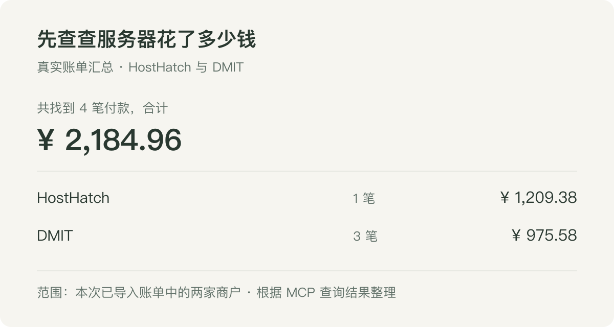
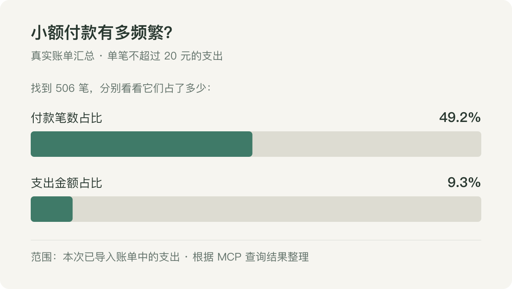

平时花钱基本都在微信和支付宝里，每一笔都有记录。真想看看自己这段时间的钱花到哪儿去了，反而没那么方便。

两个平台要分开看，记录又很碎。各自的统计能看个大概，但我偶尔想换个角度，比如把软件、会员、服务器这些费用放到一起，就又得自己翻账单、整理表格。一个问题还好，想到第二个、第三个，多少就有点懒得弄了。

我本来就是做数据开发的，对这些东西比较敏感。数据已经在那里了，而且和自己的生活直接相关，拿来做分析，其实是个很合适的场景。

正好最近一直在用 AI，就想把这件事串起来：找个地方把账单集中放好，再让 AI 能查到它们。以后想知道什么，直接问。

## 先把账单放到一起

我用的是[蜜蜂记账](https://github.com/TNT-Likely/BeeCount)。它能导入微信和支付宝的账单，也有可以自己部署的 [BeeCount Cloud](https://github.com/TNT-Likely/BeeCount-Cloud)。考虑到账单里有不少私人的东西，我选择部署在自己的 VPS 上，原始账本由自己管理。

部署这部分就不展开了，用 Docker 把服务跑起来，打开网页，再把账单导进去。具体跟着[官方部署文档](https://count.beejz.com/docs/cloud-sync/beecount-cloud/)走就好，遇到环境上的问题，也可以把文档丢给 AI 帮忙处理。

这里反倒是拿到账单有点麻烦。微信和支付宝虽然都支持导出，但还是要各自进去选时间、申请导出、拿文件，再导入记账软件。让这两个平台的数据凑到一起，总归要自己动一下手。

每天弄一遍，我肯定坚持不下来。一个月导出一次，集中导进去，勉强可以接受。暂时也不追求每花一笔钱，这边就马上更新；想回头看看最近几个月的情况，有这些记录就够我折腾了。

导入的入口和格式可以看[官方说明](https://count.beejz.com/docs/record/import-export/)。做完这一步，原来分散在两个地方的账单，就可以在同一个账本里看了。

## 再让 AI 能查到它

BeeCount Cloud 已经带了 MCP。你可以把它理解成给 AI 留了一个查账入口：我在聊天窗口里提问，AI 调用工具查询账本，拿到结果以后再回答。

我这次接的是电脑上的 Codex。大概就两件事：在蜜蜂记账的「设置 → 开发者」里创建一个访问令牌，然后把服务的 MCP 地址和令牌填到客户端里。地址就是部署地址后面加上 `/api/v1/mcp`。只想查账的话，选 `mcp:read` 就够了。

具体配置参考[蜜蜂记账的 MCP 文档](https://count.beejz.com/docs/mcp/)，不同客户端的填法略有区别。接好之后先问一句「我有哪些账本」，能查出来，就可以继续聊了。

这样不用每次聊天都重新上传一份账单。数据还在记账服务里，AI 按问题去查询，用到的结果再交给模型分析。

## 先查查服务器花了多少钱

我一开始也没设计什么复杂的分析，就是想看看它能不能回答一些平时懒得自己查的问题。

我自己有服务器，就先从这个问起：

> 帮我找一下 HostHatch 和 DMIT 的付款，加起来花了多少？

从这次导入的账单里，查到了 4 笔：HostHatch 一笔 1,209.38 元，DMIT 三笔合计 975.58 元，加起来是 **2,184.96 元**。

*根据 MCP 实际查询结果整理，只汇总本次账单中的这两家商户。*

接着再看看这些付款原来放在哪个分类里，结果全在「其他」。光看分类统计，这几笔服务器费用就混在里面了。按商户找出来，倒是一下就清楚了。

这个例子还有点好玩：记账服务本身就跑在服务器上，现在让它帮我把服务器的账单翻了出来。当然，这些机器还跑着别的东西，这笔钱也不是专门为了记账花的。

同样的问法也可以拿来查软件、会员，或者自己某个爱好的花费。看完总额，再接着问「按商户分开看看」「哪些经常出现」。不用一开始就把所有问题想好，看到什么感兴趣，就往下问。

## 小钱花得勤，加起来到底多不多

还有一种问题也挺有意思：

> 那些十几二十块的小钱，加起来是不是也不少？

这事很容易凭感觉判断。付款次数多，存在感就强，但它到底占了多少钱，还是放在一起看比较直观。

我让 AI 把单笔不超过 20 元的支出挑出来，再分别看看笔数和金额。结果有 **506 笔，占支出笔数的 49.2%，但金额只占 9.3%**。

*同样来自这次导入的真实账单，这里只展示占比。*

差不多一半的付款都在 20 元以内，加起来却不到一成。这就挺直观了：每天都有存在感的小额付款，在这份账单里并没有占到金额的大头。

还可以继续让 AI 按商户分组，看看哪几家出现得最多；或者把时间拉长，看自己常买的东西有没有变化。平时一条条看不出什么，放到一起就有点意思了。

如果看到某个月花得明显更多，也可以接着问「怎么这个月多了这么多，把几笔大的找出来看看」。对我来说，比较有用的就是这种连续追问。一个问题得到答案，新的问题也跟着出来了，顺手继续查就行。

## 做数据的，先拿自己试试

这次用下来，我觉得个人账单是一个挺适合上手的数据分析场景。数据现成，问题也是自己的，查出来有没有用，很容易感觉到。

以前想做这些，得先导出、整理，写点 SQL 或脚本，再做个图。现在导出这一步还是有点麻烦，但数据接好之后，后面的很多事情可以让 AI 帮着做了。对我这种会写代码、但未必愿意为了每个小问题都写一段代码的人来说，这点很实在。

我也没有特别想给自己做一套精细的财务管理系统。就是隔一段时间，把账单更新一下，想到什么问题就问问。能让这些一直躺在各个平台里的数据派上点用场，就已经不错了。

后面还想试试别的生活数据，比如足迹，还有自己看过的书、电影和玩过的游戏。平时工作里做了不少数据分析，也该轮到自己的数据了。
