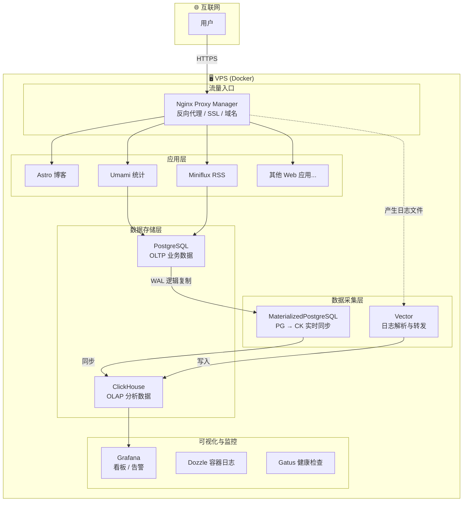
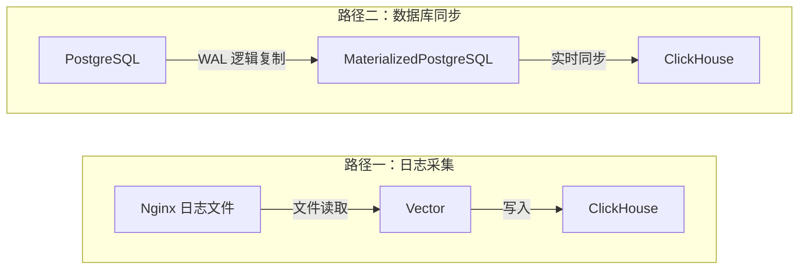

## 这个系列在讲什么？

如果你和我一样，日常工作是数据开发，你可能会好奇：**能不能在自己的 VPS 上搭一套完整的数据基础设施？**

不是为了生产环境，而是为了：

- 🧪 有一个真实的实验场地，想试什么就试什么
- 📊 让自己产生的数据（日志、业务数据）变得可查、可分析
- 🤖 为后续接入 AI（MCP）做好数据底座

这套基础设施已经在线上跑着了，你可以直接看到效果：[博客](https://site.dengshu.ovh)、[Grafana 看板](https://grafana.dengshu.ovh)、[Umami 统计](https://umami.dengshu.ovh)、[Miniflux RSS](https://miniflux.dengshu.ovh)、[服务状态](https://status.dengshu.ovh)。

这个系列分三篇：

| 篇目 | 主题 |
|------|------|
| **本篇** | 基础设施架构：Docker 编排 + 数据采集 + 存储 + 可视化 |
| 第二篇 | ClickHouse MCP：用自然语言查询你的数据仓库 |
| 第三篇 | Grafana MCP：用 AI 对话式管理看板和告警 |

## 架构全景

先看整体架构，后面逐个展开。



核心思路很简单：**所有流量经过 Nginx，产生的日志被 Vector 采集进 ClickHouse；业务数据存在 PostgreSQL，通过 MaterializedPostgreSQL 同步到 ClickHouse；最后 Grafana 统一查询和展示。**

## 流量入口：Nginx Proxy Manager

为什么用 [Nginx Proxy Manager](https://nginxproxymanager.com/) 而不是直接写 nginx.conf？

一个字：**懒**。NPM 提供了 Web UI 来管理域名、SSL 证书（Let's Encrypt 自动续期），点几下就能把 `blog.example.com` 代理到某个容器的端口。

NPM 对我们数据基础设施最重要的价值不是反代本身，而是——**它会自动产生结构化的访问日志**。这些日志就是我们数据管道的起点。

## 数据采集：两条路径

数据怎么进入我们的分析引擎？我用了两条路径：



### 路径一：Vector 日志采集

[Vector](https://vector.dev/) 是一个用 Rust 写的高性能数据管道工具。选它的原因：

- **资源占用低**：适合 VPS 这种有限资源的环境
- **配置即代码**：一个 YAML 文件搞定采集、转换、输出
- **原生支持 ClickHouse**：不需要额外的中间件

Vector 的配置遵循一个清晰的三段式结构：**Sources → Transforms → Sinks**

```yaml
# 简化后的 vector.yaml
sources:
  nginx_access_logs:
    type: file
    include:
      - /var/log/nginx/*_access.log   # 读取所有 Nginx 访问日志

transforms:
  parse_access_log:
    type: remap
    inputs: [nginx_access_logs]
    source: |
      # 用 VRL（Vector Remap Language）解析日志
      parsed = parse_regex(.message, r'^...')   # 正则匹配日志格式
      .timestamp = parse_timestamp!(parsed.timestamp, "%d/%b/%Y:%H:%M:%S %z")
      .status = to_int!(parsed.status)
      .method = string!(parsed.method)
      .host = string!(parsed.host)
      .path = string!(parsed.path)
      .client_ip = string!(parsed.client_ip)
      .user_agent = string!(parsed.user_agent)
      # ... 更多字段提取

sinks:
  clickhouse_access:
    type: clickhouse
    inputs: [parse_access_log]
    endpoint: http://clickhouse-server:8123
    database: default
    table: nginx_access_log
```

**这里有个关键细节**：Vector 容器需要能读取 Nginx 的日志文件，所以在 docker-compose 中把 Nginx 的日志目录挂载为只读卷：

```yaml
# vector 的 docker-compose.yml
volumes:
  - /root/projects/nginx/data/logs:/var/log/nginx:ro  # 挂载 Nginx 日志（只读）
```

日志在 ClickHouse 中的存储表也值得看一眼：

```sql
CREATE TABLE IF NOT EXISTS nginx_access_log (
    timestamp DateTime64(3),
    status UInt16,
    method LowCardinality(String),   -- 低基数优化
    host String,
    path String,
    client_ip String,
    user_agent String,
    -- ... 更多字段
) ENGINE = MergeTree()
PARTITION BY toYYYYMM(timestamp)     -- 按月分区
ORDER BY (host, timestamp)           -- 按 host + 时间排序
TTL timestamp + INTERVAL 90 DAY;     -- 90 天自动过期
```

:::note
`LowCardinality(String)` 是 ClickHouse 的一个小技巧——对于取值范围有限的字段（如 HTTP method 只有 GET/POST 等几种），用它可以大幅减少存储空间和提升查询性能。
:::

### 路径二：MaterializedPostgreSQL 数据库同步

日志是一种数据来源，但更多的业务数据存在 PostgreSQL 里。比如我用 PostgreSQL 存储 NodeSeek 论坛的帖子数据。

**问题是**：PostgreSQL 擅长 OLTP（事务处理），但不擅长大规模分析查询。ClickHouse 擅长 OLAP（分析），但不适合频繁的增删改。

**怎么办？** 让它们各司其职，然后用 ClickHouse 的 [MaterializedPostgreSQL](https://clickhouse.com/docs/engines/database-engines/materialized-postgresql) 引擎实时同步。

首先，PostgreSQL 需要开启逻辑复制（这是同步的前提）：

```yaml
# postgres 的 docker-compose.yml
services:
  postgres:
    image: postgres:16-alpine
    command: >
      postgres
      -c wal_level=logical           # 关键：开启逻辑复制
      -c max_replication_slots=10    # 复制槽数量
      -c max_wal_senders=10          # WAL 发送进程数
```

:::important
`wal_level=logical` 是 MaterializedPostgreSQL 的硬性要求。如果你的 PostgreSQL 没有开启这个配置，同步会直接失败。同时需要确保同步用户有 `REPLICATION` 权限。
:::

然后在 ClickHouse 中创建一个 MaterializedPostgreSQL 数据库：

```sql
-- 开启实验性功能
SET allow_experimental_database_materialized_postgresql = 1;

-- 创建同步数据库
CREATE DATABASE IF NOT EXISTS nodeseek_replica
ENGINE = MaterializedPostgreSQL(
    'postgres-server:5432',         -- PG 地址（Docker 容器名）
    'nodeseek',                     -- PG 数据库名
    'nodeseek',                     -- PG 用户名
    'your_password_here'            -- PG 密码
)
SETTINGS
    materialized_postgresql_tables_list = 'posts';  -- 要同步的表
```

**执行之后会发生什么？** ClickHouse 会自动：

1. 连接到 PostgreSQL
2. 创建逻辑复制槽
3. 执行一次全量快照
4. 然后持续消费 WAL（Write-Ahead Log）保持实时同步


## 数据存储：ClickHouse + PostgreSQL

两个数据库，各司其职：

| | PostgreSQL | ClickHouse |
|--|-----------|-----------|
| **定位** | OLTP，业务数据 | OLAP，分析查询 |
| **存什么** | 用户数据、RSS 订阅、帖子等 | 日志、同步的业务快照 |
| **查询模式** | 单行读写、事务 | 大范围扫描、聚合分析 |
| **压缩** | 普通 | 极致压缩（列式存储） |

## 可视化与监控：Grafana

数据采集了、存储了，最后一步是**让数据可见**。

[Grafana](https://grafana.com/) 同时连接 ClickHouse 和 PostgreSQL 作为数据源，可以在一个看板里展示来自不同数据库的数据。

有了这套基础设施，你可以构建的看板包括：

- **Nginx 流量看板**：各域名的请求量、状态码分布、响应时间趋势
- **错误率告警**：某个服务的 5xx 比例超过阈值时自动通知
- **业务数据看板**：从 ClickHouse 中查询同步过来的业务数据做分析

除了 Grafana，我还用了两个辅助工具：

- **[Dozzle](https://dozzle.dev/)**：实时查看所有 Docker 容器的日志，排查问题的第一工具
- **[Gatus](https://gatus.io/)**：定时检查各服务的健康状态，挂了第一时间知道

## 总结

回头看这套架构，核心就是四层：

1. **流量入口**（Nginx PM）→ 管理域名和 SSL，产生日志
2. **数据采集**（Vector + MaterializedPG）→ 日志采集 + 数据库同步，两条路径把数据汇入 ClickHouse
3. **数据存储**（PostgreSQL + ClickHouse）→ OLTP + OLAP 各司其职
4. **可视化**（Grafana）→ 统一查询和展示

全部运行在一台 VPS 上，用 Docker Compose 编排。不复杂，但够用。

**下一篇**，我会介绍如何通过 ClickHouse MCP 让 AI 直接查询这个数据仓库——用自然语言代替 SQL。

## 参考资料

- [Nginx Proxy Manager](https://nginxproxymanager.com/)
- [Vector 官方文档](https://vector.dev/docs/)
- [ClickHouse MaterializedPostgreSQL](https://clickhouse.com/docs/engines/database-engines/materialized-postgresql)
- [Grafana 官方文档](https://grafana.com/docs/)
- [Dozzle - Docker 日志查看器](https://dozzle.dev/)
- [Gatus - 健康检查](https://gatus.io/)
