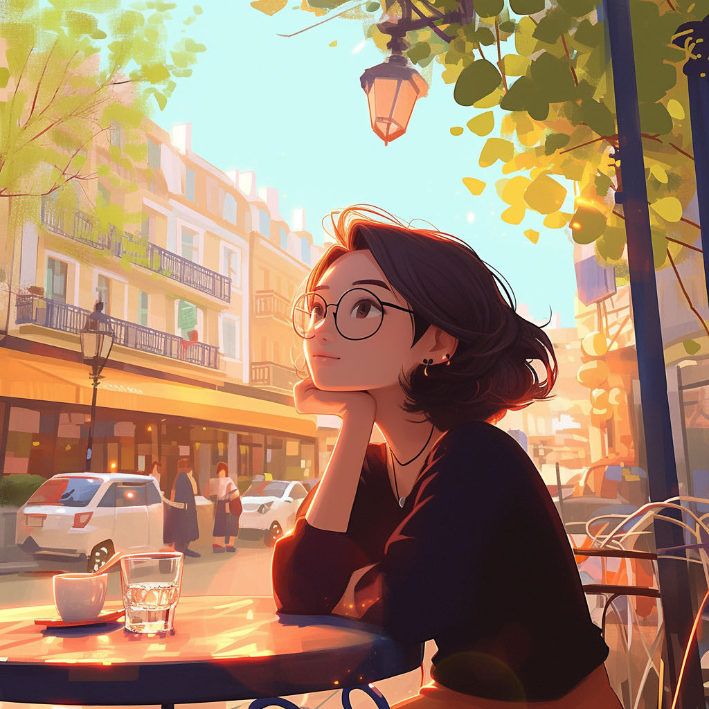

:::note[配乐]
《River Flows in You》，让文字与音符一起流淌。
<audio controls>
  <source src="/music/river-flows-in-you.mp3" type="audio/mpeg">
  Your browser does not support the audio element.
</audio>
:::

# 信

## 第一封信：写给小慧
*写在平安夜之后*

亲爱的小慧：

说实话，我这个肚子里面没有多少货的大佬粗，平时看得多写得少，连高考语文都是瞎xx考的90分。现在在电脑前写信，还真有点头秃，回车键都敲冒烟了😳。

不过想到是写给你，心里又安定了不少。你一直都是那么细腻体贴的人，想必也能理解我这个直男的笨拙表达吧？（你看，又在凭借你的善解人意蒙混过关了）

### 关于那束花

昨天平安夜的那束花，确实有些鲁莽。你说得对，朋友之间哪需要这些客套。不过你知道的，我这个人就是想到什么就做什么，有时候大脑还没反应过来，手就已经点了购买。希望没给你添太多困扰，后面我会把握分寸的。

### 关于生活

听到你父亲的事，我心里很不是滋味。我能想象那种痛，就像看着奶奶现在的状况，有时候真的很无力。不过我给我自己的信条把握当下，是做自己能做的。

你说我"有恃无恐"，其实也差不多，一样在广州苟着，如果不是出了一些新技术，一年到头了，都不知道干了啥。不过话说回来，人生就这短短几十年，该笑的时候就该痛快地笑，想哭的时候也别憋着。

听说你要搬家了，也不知道是真是假，小慧老师总是诓骗我。

### 写在最后

对了，我们也可以写写小作文互相点评，虽然我不能练成文学大家，不过至少这样的形式，多认识了自己和你一点。

你的朋友 

## 小慧的回信
*2024.12.26 于成都*

邓舒:
十分感谢你所为我做的,以及你为我所考虑的,零星不多的交流也让我渐渐认识到你是一个 内心善良,柔软但是坚强的人,知道自己想要什么,并且 在关键时刻能做出正确是样的人。这并非是溢美之词 而是我内心对你的真实评价!

在很多地方我们很相似,也许这正像你说的。 我们都是来地小镇。成长经历相似。正是这些相似让 我清楚地明白哪些地方是脆弱的,容易受伤的,我不 想做出任何让你难堪或是伤心的事。

如果你只是一个人在广东想念大学生活了,找我纯纯是为了解闷,那后面我的言辞你可以完全当作放屁哦! 我想我们俩之间最多只能容得下友情,但是你跟我所说所做的,让我认为你也许更想更及一步发展为爱情，我的选择与答复是:不可能实现。十分抱歉!

上次我给你写的几条理由如:异地什么的,那确实是事实,其实还有一点更主要的我没有写上去,当时本打算一并写上的。但是担心你会觉得难堪,所以没写,现在看来真是大错特错了.让你浪费了更多的时间在我身上。

也许在你找我聊天之前,便有朋友给我介绍对象了。 我们加了联系方式,也在成都工作,几个月的了解,我对他也有好感,他也一样,我想,我的选择就是他.

以前我不说这一点,我是怕伤害你,但是如果再不告诉你,让你浪费更多的时间,精力,岂不是对你造成更大的伤害,同样也伤害了他,我也不想放捞女或是脚踏2条船!

没办法,人生出场顺序、时机都很重。人生处处常有遗憾,正是这些遗憾才让我们懂得珍惜合适的人。

我很希望这件事，确实是我自作多情!而你仅仅只想找我解闷。

作为朋友我也想说,你肯定会在合适的时间遇到个合适的女孩,毕竟俗话说:"缘分来了,挡都挡不住"。 到时候别忘了问她:为什么让你等了这么久。

谢谢鲜花和奶茶,你的朋友——我,都很喜欢。

2024.12.26
于成都

## 第二封信：给小慧的回信
*写在收到回信之后*

下午去处逛了下，到处走走，放松一下大脑，也理清楚自己的感受。回信时间可能有点晚了：），信的内容是我的真实感受，有时候可能有点词不达意和跳脱，对我来说也是避免overthinking的一种方式。

小慧是个温柔细腻的女孩，总是在默默的支持着。在你的回信中，我能感受到一种奇怪的安全感。

### 回忆

和小慧的沟通从年初开始，中间有高潮有低谷，这个过程像是我自己重新认识自己，也在不断变化着对我俩关系的认知。

去年底，重新换了一个住处后，第一次在城中村感受到早上到阳光，生活也开始有点起色。

自己也弄了一些个新鲜玩意，想和以前一样，分享我的感受，那时候我们聊天也挺开心，小慧分享自己的生活，在海南玩，去朋友家做客...有趣而生动的女孩啊，我想。

中间我也有一些出格的举动，小慧总用各种方式躲过去。

虽然常说不要给自己下定义，我想我还是有点感性的回避性依恋，看完《机器人之梦》后，我想我是不是抓得太紧了。

我决定给自己一点点时间和空间，都说时间是个解药，好像对我没有用。

我决定最后在试试，那几天我辗转反侧，终于还是发消息了...可能她也在等我的消息，我想。

### 对于选择

爱情是什么啊？这个问题对我来说，好难回答，我想应该没有一个完美的答案，和一个完美的人。可能是一时的感性上头，实际可能是日复一日的茶米油盐，里面好多好多的未知，好多好多的困难，但是管他呢，就在此时此刻，我说我想说的，做我想做的。